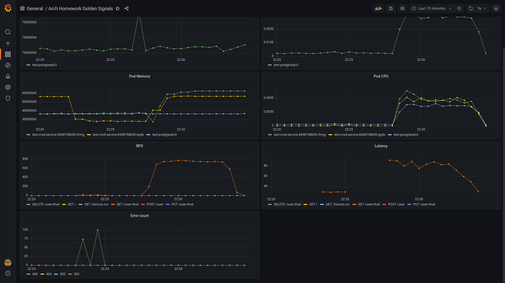

# arch.homework

## Запуск третьего домашнего задания

### Установка ingress-nginx

```
helm install nginx ingress-nginx/ingress-nginx -f nginx-ingress.yaml --atomic --create-namespace --namespace ingress-nginx
```

### Установка prometheus

```
helm install prom prometheus-community/kube-prometheus-stack -f prometheus.yaml --atomic --create-namespace --namespace monitoring
```

### Установка postgresql

```
helm install pg ./postgresql --atomic --create-namespace --namespace arch
```

### Удаление postgresql
```
helm delete -n arch pg
kubectl delete pvc -n arch data-arch-postgresql-0
```

### Установка profile-service

```
helm install profile ./profile-service --atomic --create-namespace --namespace arch
```

### Установка auth-service

```
helm install auth ./auth-service --atomic --create-namespace --namespace arch
```

## Результаты ДЗ

### Скриншот grafana dashboard



### Dashboard JSON

[JSON-file](grafana-dashboard.json)

## Minikube

Получение внешнего ip машины minikube
```
minikube service -n <namespace> <service> --url
```

Установка ingress-nginx
```
minikube addons enable ingress
```


