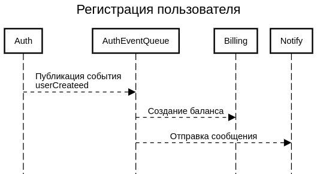
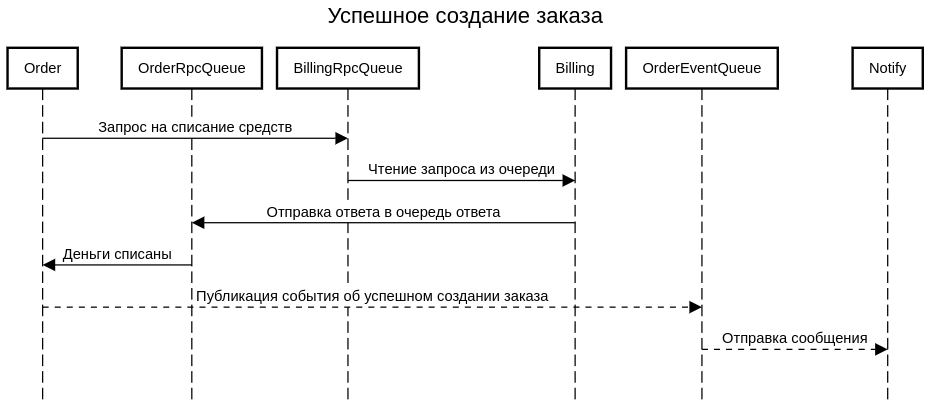
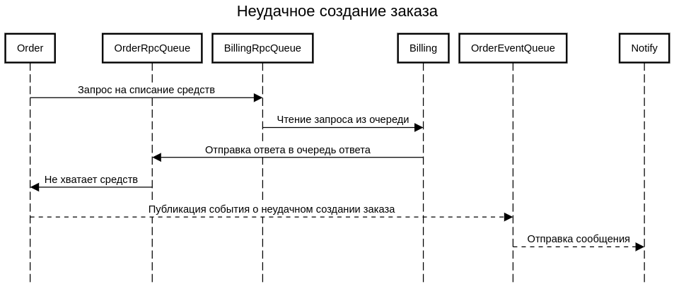

# arch.homework

## Запуск шестого домашнего задания

## Добавление bitnami репозитория

```
helm repo add bitnami https://charts.bitnami.com/bitnami
```

### Запуск minikube

```
minikube start
minikube addons enable ingress
```

### Установка postgresql

```
helm install pg ./postgresql --atomic --create-namespace --namespace arch
```

### Установка rabbitmq

```
helm install rmq bitnami/rabbitmq --create-namespace --namespace arch
```


### Установка auth-service

```
helm install auth ./auth-service --atomic --create-namespace --namespace arch
```


### Установка billing-service

```
helm install billing ./billing-service --atomic --create-namespace --namespace arch
```

### Установка notify-service

```
helm install notify ./notify-service --atomic --create-namespace --namespace arch
```

### Установка order-service

```
helm install order ./order-service --atomic --create-namespace --namespace arch
```


### Настройка nginx-ingress

```
kubectl apply -f ./nginx-ingress/routes.yaml
```

## Результаты ДЗ

### Диаграмма последовательности авторизации




### Диаграмма последовательности создания заказа





### Команда для запуска тестов newman

```
newman run ./tests.postman_collection.json --env-var "baseUrl=arch.homework" --verbose
```

## Minikube

Получение внешнего ip машины minikube
```
minikube service -n <namespace> <service> --url
```

Установка ingress-nginx
```
minikube addons enable ingress
```
