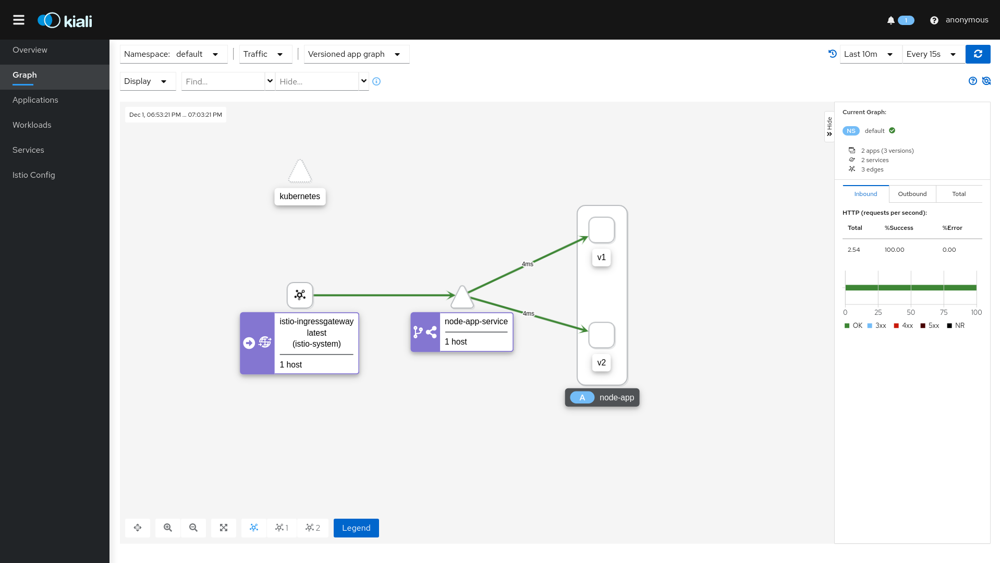

# arch.homework

## Запуск четвертого домашнего задания

### Запуск minikube

```
minikube start --cpus=4 --memory=6g --cni=flannel --kubernetes-version="v1.19.0"
```

### Установка istio в kubernetes

```
istioctl install --set profile=demo -y
```

### Добавление istio в namespace

```
kubectl label namespace default istio-injection=enabled
```

### Установка node-app

```
kubectl apply -f node-app/manifest.yml
```

### Установка istio-gateway

```
kubectl apply -f istio-gateway/manifest.yml
```

### Проверка корректности установки istio

```
istioctl analyze
```

### Установка prometheus, grafana, jaeger, kiali

```
kubectl apply -f addons
kubectl rollout status deployment/kiali -n istio-system
```

## Проверка работы

### Запуск kiali dashboard

```
istioctl dashboard kiali
```

### Нагрузка на сервисы

```
export INGRESS_PORT=$(kubectl -n istio-system get service istio-ingressgateway -o jsonpath='{.spec.ports[?(@.name=="http2")].nodePort}')
export INGRESS_HOST=$(minikube ip)
export GATEWAY_URL=$INGRESS_HOST:$INGRESS_PORT

for i in $(seq 1 500); do curl -s -o /dev/null "http://$GATEWAY_URL/health"; done
```

## Результаты ДЗ

### Скриншот графа в kiali



## Minikube

Получение внешнего ip машины minikube
```
minikube service -n <namespace> <service> --url
```

Установка ingress-nginx
```
minikube addons enable ingress
```


