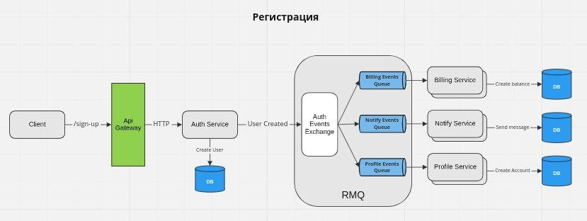
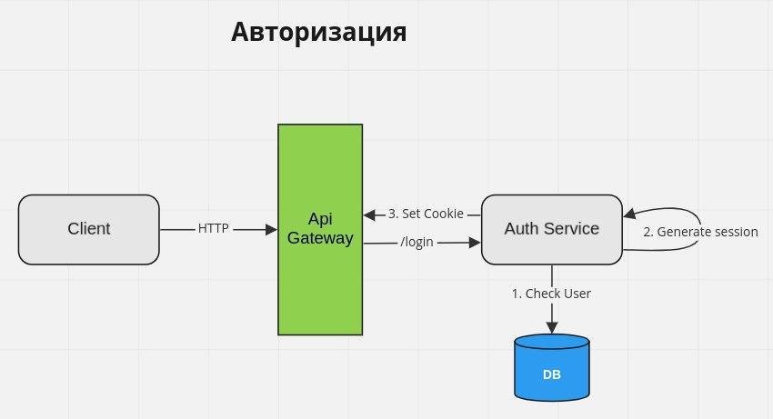
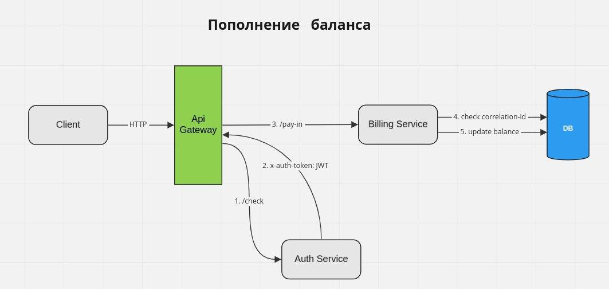
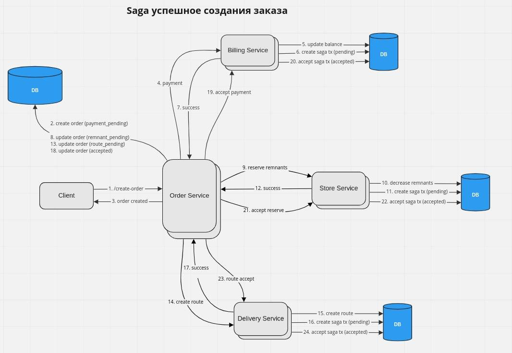
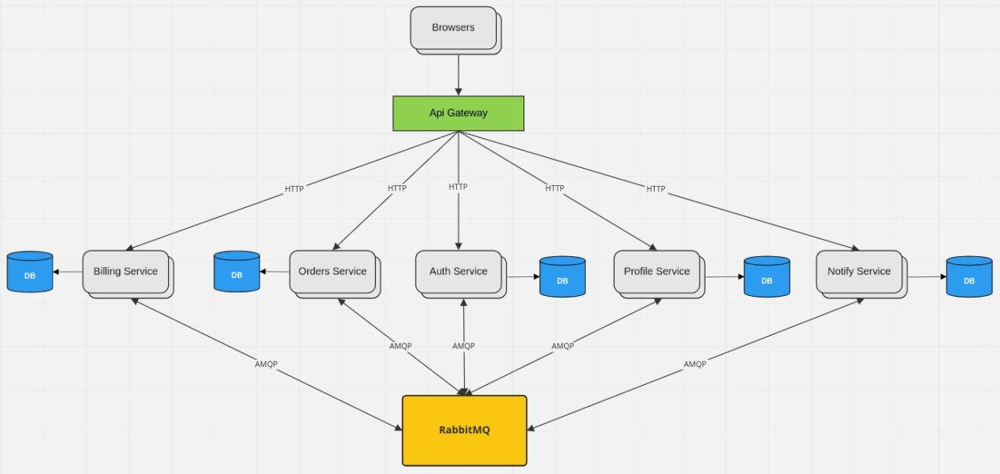

# arch.homework

## Запуск девятого домашнего задания

## Добавление bitnami репозитория

```
helm repo add bitnami https://charts.bitnami.com/bitnami
```

### Запуск minikube

```
minikube start
minikube addons enable ingress
```

### Установка postgresql

```
helm install pg ./postgresql --atomic --create-namespace --namespace arch
```

### Установка rabbitmq

```
helm install rmq bitnami/rabbitmq --create-namespace --namespace arch
```


### Установка auth-service

```
helm install auth ./auth-service --atomic --create-namespace --namespace arch
```


### Установка billing-service

```
helm install billing ./billing-service --atomic --create-namespace --namespace arch
```

### Установка notify-service

```
helm install notify ./notify-service --atomic --create-namespace --namespace arch
```

### Установка order-service

```
helm install order ./order-service --atomic --create-namespace --namespace arch
```

### Установка profile-service

```
helm install profile ./profile-service --atomic --create-namespace --namespace arch
```

### Установка store-service

```
helm install store ./store-service --atomic --create-namespace --namespace arch
```

### Установка delivery-service

```
helm install delivery ./delivery-service --atomic --create-namespace --namespace arch
```

### Настройка nginx-ingress

```
kubectl apply -f ./nginx-ingress/routes.yaml
```

# Пользовательские сценарии

## Регистрация

## Авторизация

## Пополнение баланса

## Создание заказа


## Общая схема взаимодействия сервисов


# Назначения сервисов

## Auth service

Сервис служит для регистрации, авторизации и разлогина пользователей

- При регистрации сервис публикует событие в брокер сообщений
- При логине создает сессию и помещает в куки `session-id`
- При запросах в другие сервисы **Api Gateway** запрашивает jwt-токен у **Auth Service** и помещает его в заголовок `x-auth-token`

## Billing service

Сервис служит для выполнения платежных операций и работы с балансом пользователя

- Подписывается на событие от **Auth Service** о создании пользователя и создает нулевой баланс
- Подписывается на RPC запросы от **Order Service** для вывода средств с баланса пользователя
- Запросы на пополнение и вывод средств - идемпотенты

## Order service

Сервис служит для создания и просмотра заказов.

- При создании заказа
    1. Создает заказ со статусом `accept_pending`
    2. Отправляет RPC запрос в сервис **Billing Service** для снятия средств
    3. В случае успеха:
        - Помечает заказ статусом `accepted`
        - Публикует событие публикует событие об успешном создании заказа
    4. В случае неудачного списания:
        - Помечает заказ статусом `rejected`
        - Публикует событие публикует событие о неуспешном создании заказа
- Запрос на создание заказа - идемпотентен


## Notify service

Сервис служит для отправки и просмотра сообщений пользователя.

- Подписывается на событие от **Auth Service** о создании пользователя и отправляет сообщение об успешной регистрации
- Подписывается на событие от **Order Service** о создании заказа и отправляет сообщение о результате создания заказа


## Profile service

Сервис служит для работы с профилем пользователя, получение и редактирование

- Подписывается на событие от **Auth Service** о создании пользователя и создает профиль пользователя

# Контракты взаимодействия

## Внешнее взаимодействие

- Всё взаимодействие с клиентами происходит через api gateway `Nginx`
- Запросы в **Auth Service** идут напрямую от api gateway
- Запросы в остальные сервисы проходят проверку на авторизацию через **Auth Service**

## Внутренне взаимодействие

- Всё взаимодействие между сервисами происходит через брокера сообщений `RabbitMQ`
- Для событий, публикуемых сервисом, создается собственная `direct` биржа `<service>_events`, на которую подписываются все желающие консьюмеры.
- Для RPC запросов существует общая биржа `rpc_exchange`
- Для получения RPC запросов сервис создает очередь `<service>_service` в брокере `rpc_exchange`
- При отправке RPC запроса сервис указывает `exclusive` очередь для получения ответа


### Команда для запуска тестов newman

```
newman run ./tests.postman_collection.json --env-var "baseUrl=arch.homework" --verbose
```


## Minikube

Получение внешнего ip машины minikube
```
minikube service -n <namespace> <service> --url
```

Установка ingress-nginx
```
minikube addons enable ingress
```
