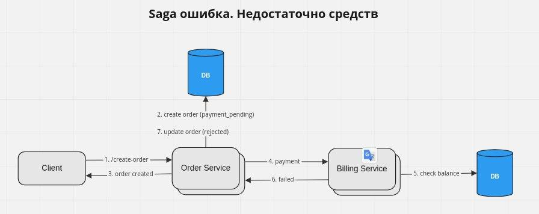
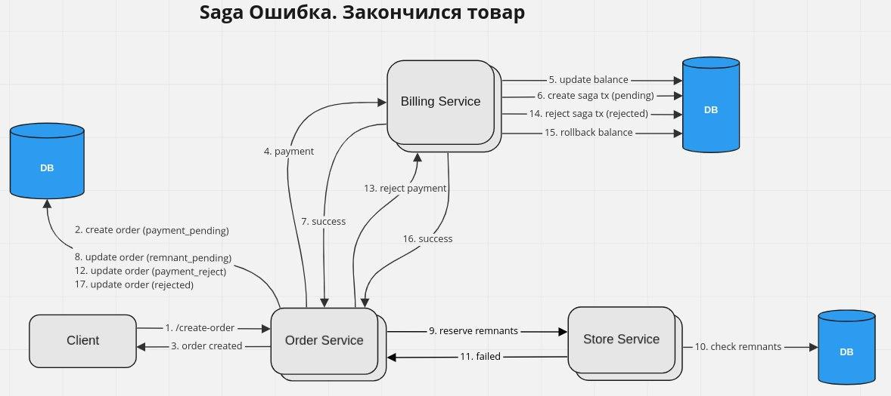
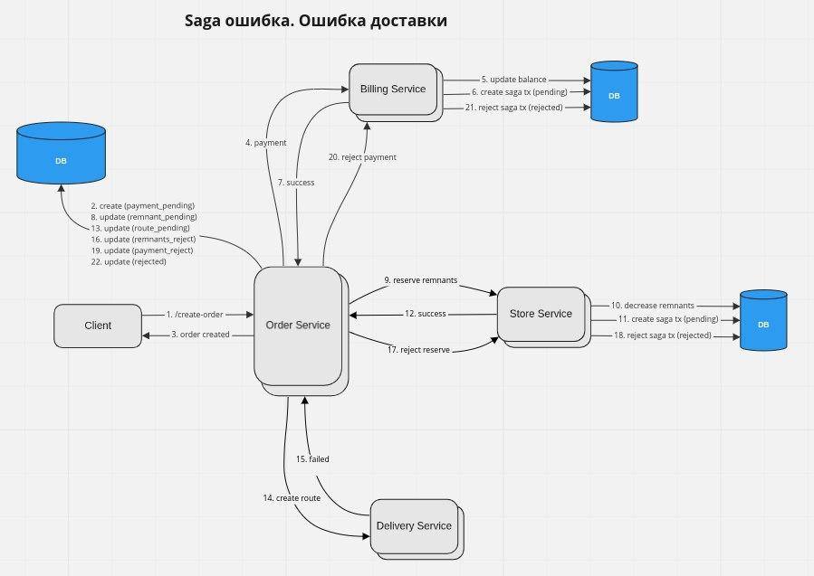

# arch.homework

## Запуск девятого домашнего задания

## Добавление bitnami репозитория

```
helm repo add bitnami https://charts.bitnami.com/bitnami
```

### Запуск minikube

```
minikube start
minikube addons enable ingress
```

### Установка postgresql

```
helm install pg ./postgresql --atomic --create-namespace --namespace arch
```

### Установка rabbitmq

```
helm install rmq bitnami/rabbitmq --create-namespace --namespace arch
```


### Установка auth-service

```
helm install auth ./auth-service --atomic --create-namespace --namespace arch
```

### Установка billing-service

```
helm install billing ./billing-service --atomic --create-namespace --namespace arch
```

### Установка order-service

```
helm install order ./order-service --atomic --create-namespace --namespace arch
```

### Установка store-service

```
helm install store ./store-service --atomic --create-namespace --namespace arch
```

### Установка delivery-service

```
helm install delivery ./delivery-service --atomic --create-namespace --namespace arch
```

### Настройка nginx-ingress

```
kubectl apply -f ./nginx-ingress/routes.yaml
```

# Пользовательские сценарии
## Создание заказа


## Недостаточно средств на балансе пользователя


## Недостаточно остатков на складе


## Какая-нибудь ошибка доставки


# Контракты взаимодействия Saga транзакции

- Всё взаимодействие между сервисами происходит через брокера сообщений `RabbitMQ`
- Все сообщения, связанные с saga транзакцией, обрабатываются через биржу `saga_exchange`
- Сервис `order` является оркестратором saga-транзакции
- Сервисы `billing`, `store` и `delivery` являются потребителями saga-транзакции

# Алгоритм успешного выполнения Saga транзакции

1. Создается заказ со статусом `payment_pending`
2. Отправляется запрос в `billing` сервис для снятия средств с баланса
3. `billing` сервис холдирует средства на счете и создает запись о saga-транзакции со статусом `pending`
4. При успешном холдировании счета, заказ переходит в статус `remnant_pending`
5. `store` сервис резервирует остатки и создает запись о saga-транзации со статусом `pending`
6. При успешном резерве остатков, заказ переходит в статус `route_pending`
7. `delivery` сервис создает маршрут и создает запись о saga-транзации со статусом `pending`
8. При успешном создании маршруте, заказ переходит в статус `accepted` и оповещает об успешном завершении транзакции всех потребителей
9. Сервисы `billing`, `store` и `delivery` переводят свои saga-транзакции в состояние `accepted`

# Алгоритм неуспешного выполнения Saga транзакции

1. Создается заказ со статусом `payment_pending`
2. Отправляется запрос в `billing` сервис для снятия средств с баланса
3. `billing` сервис холдирует средства на счете и создает запись о saga-транзакции со статусом `pending`
4. При успешном холдировании счета, заказ переходит в статус `remnant_pending`
5. `store` сервис резервирует остатки и создает запись о saga-транзации со статусом `pending`
6. При **неуспешном** резерве остатков, заказ переходит в статус `payment_reject`
7. `billing` возвращает средства на баланс и переводит saga-транзакцию в состояние `rejected`
8. При успешном возврате средств, заказ переходит в статус `rejected`


### Команда для запуска тестов newman

```
newman run ./tests.postman_collection.json --env-var "baseUrl=arch.homework" --verbose --delay-request 100
```


## Minikube

Получение внешнего ip машины minikube
```
minikube service -n <namespace> <service> --url
```

Установка ingress-nginx
```
minikube addons enable ingress
```
